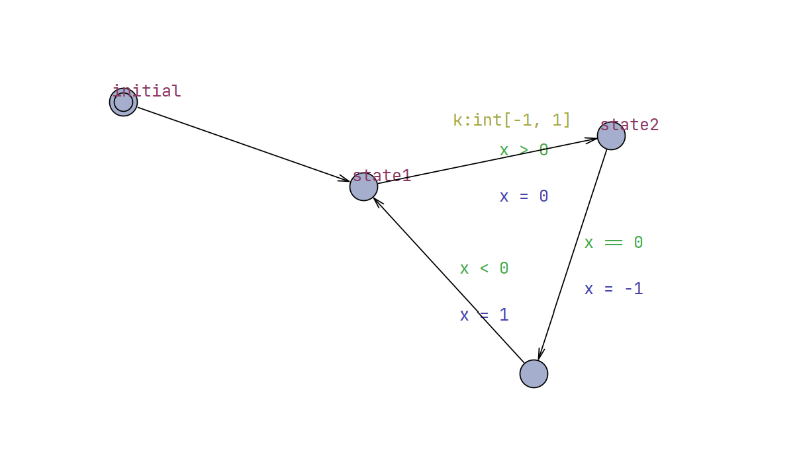

# UPPAAL Creator

Create UPPAAL models from python networkx graphs.

## build pypi package

```cmd
pip install autoflake black isort pytest
pytest -s
pip install build
python3 -m build
```

## Examples

```python
from typing import cast
import networkx as nx
from uppaal_creator import UPPAALCreator


G = nx.DiGraph()
for edge in [(0, 1), (1, 2), (2, 3), (3, 1)]:
    G.add_edge(edge[0], edge[1])
state_labels = {
    0: "initial",
    1: "state1",
    2: "state2",
}  # Omitted label for node #3 indicates the label is empty.
guards = {(1, 2): "x > 0", (2, 3): "x == 0", (3, 1): "x < 0"}
updates = {(1, 2): "x = 0", (2, 3): "x = -1", (3, 1): "x = 1"}
selects = {(1, 2): "k:int[-1, 1]"}

creator = UPPAALCreator("./output", "generated-model", True)
creator.add_global_decls("int x = 0;")
creator.add_template_from_graph(
    G,
    "demo_template",
    0,
    cast(dict[int, str], state_labels),
    selects,
    guards,
    updates,
    [],
)
creator.finish_model_creation()
```

The created file can be found in `output` directory,
the topology is shown below:


